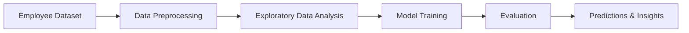

# Employee Insights – Predictive Analytics

## 📌 Overview
**Employee Insights** is a machine learning project aimed at predicting key HR-related outcomes such as attrition, performance ratings, and promotion likelihood. The project leverages employee data to help organizations make informed decisions and improve workforce management.

By identifying high-risk employees for attrition, estimating performance ratings, and predicting promotion opportunities, the system provides actionable insights for HR teams to take preventive and growth-oriented measures.

---

## 🎯 Project Goals
This project focuses on **two primary predictions** (you can choose based on dataset availability):

1. **Employee Attrition Prediction**
   - **Goal:** Predict whether an employee will leave the company.
   - **Target Variable:** `Attrition` (1 = Leave, 0 = Stay)
   - **Example Features:** Age, Department, Monthly Income, Job Satisfaction, Years at Company, Marital Status, Overtime.

2. **Performance Rating Prediction**
   - **Goal:** Predict the employee’s performance rating.
   - **Target Variable:** `PerformanceRating`
   - **Example Features:** Education, Job Involvement, Job Level, Monthly Income, Years at Company, Years in Current Role.

(Alternative: You can also predict **promotion likelihood** based on performance, job level, and tenure.)

---

## 📊 Example Use Cases
- **Attrition Prevention:** Identify employees likely to leave and implement retention strategies.
- **Performance Assessment:** Predict ratings for better performance reviews and career growth planning.
- **Promotion Planning:** Forecast potential promotions to encourage career development.

---

## 🛠 Tech Stack


---

## 📂 Folder Structure
```
employee-insights/
│
├── data/                     # Raw and processed datasets
│   ├── employee_data.csv
│   └── README.md
│
├── notebooks/                # Jupyter/Colab notebooks for experiments
│   ├── EDA.ipynb
│   ├── attrition_model.ipynb
│   └── performance_model.ipynb
│
├── models/                   # Saved trained models
│   ├── attrition_model.pkl
│   └── performance_model.pkl
│
├── visuals/                  # Charts, graphs, and output images
│   ├── feature_importance.png
│   └── confusion_matrix.png
│
├── requirements.txt          # Python dependencies
├── README.md                 # Project documentation
└── LICENSE                   # License file
```

---

## 🔍 Approach

### 1. Data Preparation
- Clean and preprocess employee dataset.
- Handle missing values, encode categorical features, and scale numerical data.

### 2. Exploratory Data Analysis (EDA)
- Visualize key trends and relationships between features and target variables.
- Identify patterns affecting attrition, performance, and promotions.

### 3. Model Building
- Train ML models like **Logistic Regression**, **Decision Tree**, or **Random Forest**.
- Split dataset into **train/test** sets for evaluation.

### 4. Evaluation
- **Classification:** Accuracy, Precision, Recall, F1-score
- **Regression:** RMSE, MAE

---

## 🚀 How to Run

1. **Clone the repository**
   ```bash
   git clone https://github.com/your-username/employee-insights.git
   cd employee-insights
   ```

2. **Install dependencies**
   ```bash
   pip install -r requirements.txt
   ```

3. **Run the notebook**
   - Open `notebooks/EDA.ipynb` or model notebooks.
   - Execute cells step-by-step to train and test the model.

4. **View Results**
   - Predictions with evaluation metrics and visualizations.

---

## 📈 Workflow Diagram



---

## 🤝 Contributing
Fork the repo, make improvements, and submit a pull request.

---

## 📜 License
This project is licensed under the **MIT License** – see the [LICENSE](LICENSE) file for details.
